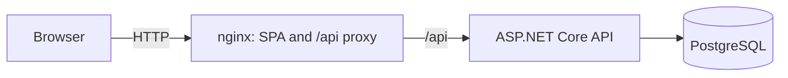

# TaskBoard

[](https://github.com/wajfy/TaskBoard/actions/workflows/ci.yml)

A full-stack Kanban task manager built with ASP.NET Core and React. Users sign up, create projects, and move tasks between **Todo**, **In Progress** and **Done** by drag and drop. Every user sees only their own data.

The project is a practice ground for the things a mid-level full-stack developer is expected to handle: a layered API, authentication with token rotation, authorization by data ownership, a typed SPA, integration tests against a real database, CI, and containerized delivery.

## Features

- Registration and login with JWT access tokens and single-use, rotating refresh tokens
- Projects: create, edit, delete, archive and restore
- Tasks with title, description and status, edited in a modal or moved by drag and drop
- Per-user data isolation: other users' projects and tasks are invisible and unmodifiable
- Optimistic status changes with rollback and an error message when the server rejects them
- Responsive dark UI with frosted-glass panels

## Tech stack

| Area | Technologies |
| --- | --- |
| API | .NET 9, ASP.NET Core controllers, EF Core 9, Npgsql, ASP.NET Core Identity, JWT Bearer |
| Database | PostgreSQL 16, EF Core migrations |
| API docs | OpenAPI and Scalar (Development only) |
| Frontend | React 19, TypeScript (strict), Vite, React Router, TanStack Query |
| UI | Tailwind CSS 4, shadcn/ui on Base UI, dnd-kit, lucide-react |
| Tests | xUnit, `WebApplicationFactory`, Testcontainers (PostgreSQL) |
| Delivery | Docker, nginx, Docker Compose, GitHub Actions, GitHub Container Registry |

## Architecture



In production nginx serves the built SPA and proxies `/api` to the API, so the browser talks to a single origin. During development the Vite dev server plays the same role through its proxy.

The API is layered: **controllers** handle HTTP concerns and map results to status codes, **services** hold the business logic and ownership rules, and **`AppDbContext`** is used directly by the services. Entities never leave the service layer; the API exposes purpose-built DTO records.

## Getting started

### Run everything with Docker

Requires Docker.

```bash
cp .env.example .env
```

Open `.env` and set `JWT_KEY` to a random string of at least 32 characters (on Windows use `copy` instead of `cp`). Then:

```bash
docker compose -f docker-compose.yml -f docker-compose.app.yml up -d --build
```

The app is available at http://localhost:8080. Stop it with:

```bash
docker compose -f docker-compose.yml -f docker-compose.app.yml down
```

Add `--volumes` to the last command to delete the database as well.

### Local development

Requires the .NET 9 SDK, Node.js 22 and Docker (for the database).

Start PostgreSQL:

```bash
docker compose up -d
```

Configure the JWT signing key (kept out of the repository with user secrets), install the EF Core CLI once, and apply the migrations:

```bash
dotnet user-secrets set "Jwt:Key" "a-random-string-of-at-least-32-characters" --project src/TaskBoard.Api
```
```bash
dotnet tool install --global dotnet-ef
```
```bash
dotnet ef database update --project src/TaskBoard.Api
```

Run the API (http://localhost:5080, interactive docs at http://localhost:5080/scalar/v1):

```bash
dotnet run --project src/TaskBoard.Api --launch-profile http
```

Run the frontend in a second terminal (http://localhost:5173, `/api` is proxied to the API):

```bash
cd client
npm install
npm run dev
```

## Configuration

| Setting | Where | Purpose |
| --- | --- | --- |
| `JWT_KEY` / `Jwt:Key` | `.env` (Docker), user secrets (local) | Signing key for access tokens, at least 32 characters |
| `WEB_PORT` | `.env` | Host port of the web container, default `8080` |
| `DB_PORT` | `.env` | Host port of PostgreSQL, default `5432` |
| `ConnectionStrings:Default` | `appsettings.Development.json`, environment | Database connection string |
| `Database:MigrateOnStartup` | environment | Applies migrations when the API starts. Enabled by `docker-compose.app.yml`, off otherwise |
| `Jwt:AccessTokenMinutes`, `Jwt:RefreshTokenDays` | `appsettings.json` | Token lifetimes, 15 minutes and 7 days |

## API overview

All project and task endpoints require a `Bearer` access token. Creating a project or task returns `201` with a `Location` header, updating and deleting return `204`, and a project or task that does not exist or belongs to another user returns `404`. Listing the tasks of another user's project returns an empty list instead.

| Method | Endpoint | Description |
| --- | --- | --- |
| POST | `/api/auth/register` | Create an account and receive tokens |
| POST | `/api/auth/login` | Sign in and receive tokens |
| POST | `/api/auth/refresh` | Exchange a refresh token for a new pair (the old one is revoked) |
| POST | `/api/auth/logout` | Revoke a refresh token |
| GET | `/api/projects?archived=false` | List active (or, with `true`, archived) projects |
| POST | `/api/projects` | Create a project |
| GET, PUT, DELETE | `/api/projects/{id}` | Read, update or delete a project |
| POST | `/api/projects/{id}/archive` | Archive a project |
| POST | `/api/projects/{id}/unarchive` | Restore a project |
| GET, POST | `/api/projects/{projectId}/tasks` | List or create tasks of a project |
| GET, PUT, DELETE | `/api/projects/{projectId}/tasks/{id}` | Read, update or delete a task |

Task statuses are `Todo`, `InProgress` and `Done`, serialized as strings.

## Testing

```bash
dotnet test
```

The suite has 101 tests, mostly integration tests that start the whole API in memory against a real PostgreSQL container (Docker must be running). It covers authentication and token handling, JWT validation (wrong key, expiry, issuer, audience), input validation and its boundaries, the archive workflow, cascade deletes, and, above all, data ownership: every endpoint that takes a project or task is called by a second user, which must get `404` and leave the owner's data untouched. A reflection test also fails if a new controller is added without `[Authorize]`.

Frontend checks:

```bash
cd client
npm run lint
npm run build
```

## Continuous integration and delivery

`.github/workflows/ci.yml` runs on every push to `master` and on pull requests:

| Job | What it does |
| --- | --- |
| Backend | Restore, build in Release, run all tests |
| Frontend | `npm ci`, lint, type-check and production build |
| Stack | Builds the Docker Compose stack and runs `scripts/smoke-test.sh` against it: API through the proxy, SPA routing, registration, a rejected anonymous request, a database write and read |
| Images | On `master` only, after the jobs above pass: builds and pushes the `api` and `web` images to GitHub Container Registry |

## Project structure

```
.
├── src/TaskBoard.Api        ASP.NET Core API
│   ├── Controllers          HTTP layer
│   ├── Services             business logic and ownership rules
│   ├── Data                 DbContext, entities, DTOs
│   └── Migrations
├── tests/TaskBoard.Api.Tests
├── client                   React single-page app
│   └── src                  api, auth, components, pages
├── scripts/smoke-test.sh    end-to-end check used by CI
├── docker-compose.yml       PostgreSQL for development
├── docker-compose.app.yml   adds the API and web containers
└── .github/workflows/ci.yml
```

## Design decisions

- **No repository layer.** `DbContext` is already a unit of work and `DbSet` a repository. Services query it directly, which keeps `Include`, projections and `AsNoTracking` available instead of hiding them behind generic methods.
- **Ownership is part of the query.** Every lookup filters by the current user (tasks through their project). A foreign resource is indistinguishable from a missing one, so the API never confirms that someone else's data exists.
- **Refresh token rotation.** Access tokens live 15 minutes. A refresh token can be used once; using it again fails. The client refreshes transparently on `401` and shares a single in-flight refresh between concurrent requests.
- **Tests run against real PostgreSQL.** The in-memory provider does not enforce foreign keys or cascade deletes, which is exactly what several tests check.
- **Optimistic Kanban moves.** A dropped card is applied through local state in the same render as the end of the drag. Updating the TanStack Query cache from `onMutate` arrived a tick later and made the card flash back into its old column.
- **Small, non-root containers.** The API and nginx run as unprivileged users, hashed assets are cached as immutable and `index.html` is always revalidated, so a new deployment is picked up immediately.

## Known limitations

- Tokens are kept in `localStorage`, which is exposed to XSS. An `httpOnly` cookie for the refresh token would be the sturdier choice.
- There is no rate limiting or lockout on the authentication endpoints.
- Lists are not paginated.
- Applying migrations at startup suits a single instance; with several replicas it needs a separate migration step.
- There are no frontend tests yet.
- The database credentials in the Compose files are development defaults.
